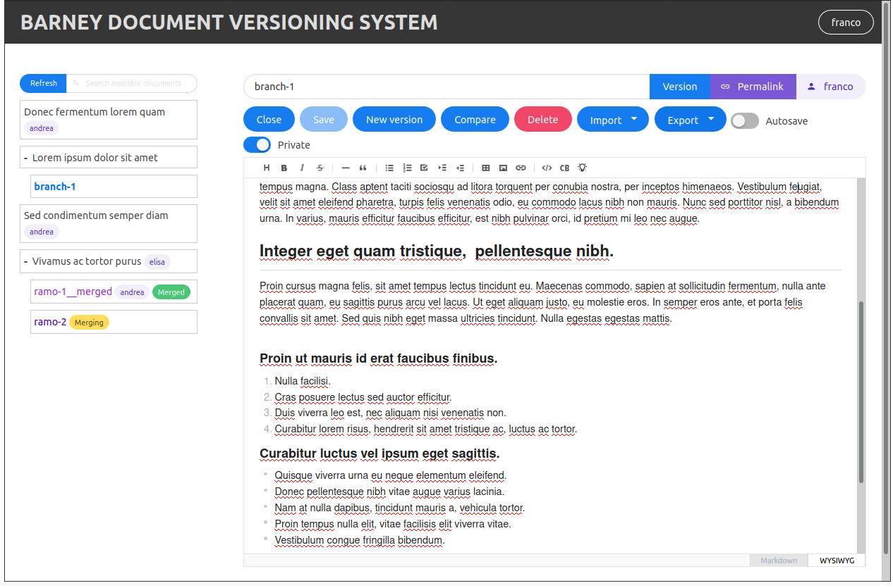

 

# barney_document_versioning
a django app with vue frontend for easy collaborative versioning of markdown text contents



### Backend installation

install pandoc package, 

```
sudo apt update
sudo apt install pandoc
```

open a terminal Clone the repository, 

```
git clone https://github.com/enricofer/barney_document_versioning.git
cd barney_document_versioning
```

then,

```
pip install -r requirements.txt
```

```
python manage.py migrate
```

```
python manage.py createsuperuser
```

```
python manage.py runserver
```

now a development server should run on localhost on port 8000

open the already builded frontend app  with the following url:

```
http://localhost:8000/version/
```

### Frontend installation

Frontend app could be run from npm. In this case you have to open a new terminal from the same directory and move to frontend directory

```
cd frontend
```

now install javascript modules

```
npm install
```

and run a development app on localhost at port 3000

```
npm run dev
```

or build the new frontend app (the build files are copied to `version/static/version/frontend` directory)

```
npm run build
```

